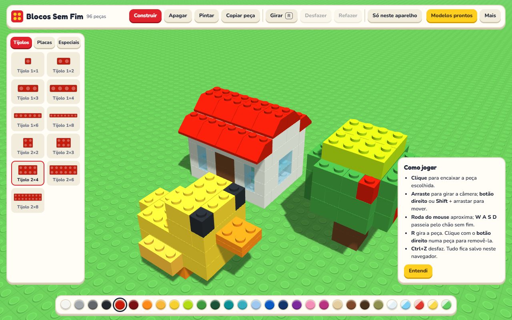

# Blocos Sem Fim

[](https://joaogabrielmontinirossi-sys.github.io/blocos-sem-fim/)

Um simulador 3D de blocos de montar, só para lazer. O chão de pinos não tem fim, as peças encaixam onde você clica e há **38 modelos prontos** para montar peça por peça ou colocar de uma vez.

Faz parte da família [Blocos](https://github.com/joaogabrielmontinirossi-sys/blocos), [Blocos 2](https://github.com/joaogabrielmontinirossi-sys/blocos2) e [Blocos 3](https://github.com/joaogabrielmontinirossi-sys/blocos3); aqui não há tarefas, só construção.

## Baixar (Windows)

Pegue o `BlocosSemFim.exe` na página de [Releases](../../releases/latest) e abra. Não precisa instalar nada: o programa usa o Edge (ou o Chrome) que já está no Windows para mostrar a janela.

Como o arquivo não é assinado, o Windows pode mostrar o aviso do SmartScreen na primeira vez: clique em **Mais informações** e depois em **Executar assim mesmo**.

Na primeira abertura o programa precisa de internet para buscar a biblioteca 3D; depois disso ela fica guardada e ele abre sem internet.

## No site e no celular

Abra **https://joaogabrielmontinirossi-sys.github.io/blocos-sem-fim/** em qualquer navegador.

- **Android (Chrome)**: ⋮ › *Adicionar à tela inicial*.
- **iPhone/iPad (Safari)**: **Compartilhar** › **Adicionar à Tela de Início**.

Depois de aberta uma vez, a versão web funciona sem internet.

## Como funciona

- **Construir**: escolha a peça e a cor e clique. As peças empilham sozinhas onde você aponta; `R` gira.
- **Peças**: 37 formatos entre tijolos, placas, rampas, cilindros, cones e peças lisas, em 29 cores (cinco delas transparentes).
- **Ferramentas**: construir, apagar, pintar, copiar peça, desfazer e refazer.
- **Câmera**: arraste para girar, botão direito (ou `Shift`) para mover, roda do mouse para aproximar, `W A S D` para passear. No celular, um dedo gira e dois dedos aproximam e movem.
- **Modelos prontos**: casinha, torre de vigia, castelo, farol, ponte suspensa, arranha-céu, moinho, pirâmide, pagode, carro, caminhão, ônibus escolar, locomotiva, avião, helicóptero, veleiro, foguete, disco voador, robô, boneco de neve, bolo, coração, arco-íris, alienígena, cachorro, gato, patinho, girafa, elefante, dinossauro, pinguim, tartaruga, peixe-palhaço, árvore, pinheiro, flor, cacto e cogumelo.
  - **Montar** mostra a próxima peça piscando; `Espaço` encaixa, e há o modo automático.
  - **Colocar** põe o modelo inteiro onde você clicar.
- **Backup**: em **Mais** dá para exportar e importar a construção num arquivo.

## Sincronização

Funciona como nos outros aplicativos da família:

1. **Pasta do Google Drive para computador** (só no `.exe`): grava `blocos-sem-fim-sync.json` em `Meu Drive\BlocosSemFim` a cada alteração. Se o Google Drive para computador estiver instalado, já começa ligada; em **Mais › Sincronização** dá para desativar, trocar de conta ou escolher outra pasta.
2. **Conta Google** (`.exe`, site e celular): o mesmo arquivo fica na área privada do aplicativo no seu Google Drive. Usa o mesmo "ID do cliente OAuth" dos outros aplicativos; para o `.exe`, acrescente a origem `http://localhost:47896`.

Alterações feitas em dois aparelhos são mescladas peça por peça: vale a versão mais recente de cada uma, e as exclusões também são propagadas. Se duas peças postas em aparelhos diferentes ocuparem o mesmo lugar, fica a mais nova. A posição da câmera fica só no aparelho.

## Compilar

Só precisa do Windows (usa o compilador C# do .NET Framework, que já vem instalado):

```powershell
powershell -ExecutionPolicy Bypass -File .\build.ps1
```

| Pasta | Conteúdo |
| --- | --- |
| `app/app.js` | A cena 3D, as peças, os modelos prontos e a mescla da sincronização |
| `app/sync.js` | Sincronização pela pasta e pela conta Google |
| `app/sw.js` | Guarda o app para abrir sem internet |
| `desktop/BlocosSemFim.cs` | Programa de Windows: serve o app em `localhost` e grava a pasta de sincronização |
| `.github/workflows/` | Publica o site no GitHub Pages e o `.exe` em Releases a cada envio para a `main` |

O desenho 3D usa a biblioteca [three.js](https://threejs.org) (licença MIT), carregada do cdnjs.

## Licença

[MIT](LICENSE): pode usar, copiar, modificar e distribuir livremente, mantendo o aviso de autoria.
